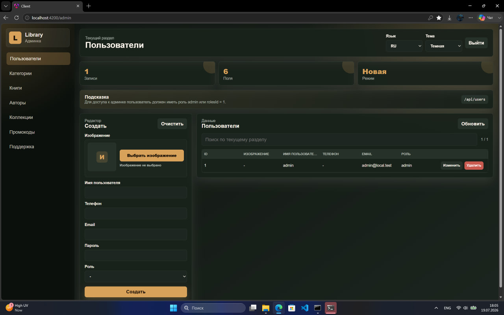

# Library Project

Проект для хранения, просмотра и управления библиотекой манги и манхвы. Включает мобильное приложение на Flutter, API-сервер на NestJS и веб-клиент на Angular.

## Описание проекта

Этот проект объединяет:

- мобильное приложение для чтения контента;
- серверную часть для работы с данными и API;
- веб-интерфейс для управления и навигации;
- систему хранения локальных архивов и загруженных файлов.

Идея проекта — удобное чтение комиксов, манги и манхвы с возможностью организации папок, управления сериями и работы с локальными файлами.

## Основные возможности

- чтение манги и манхвы в приложении;
- поддержка локальных архивов и файлов EPUB;
- работа с библиотекой и каталогом серий;
- загрузка и обработка файлов из папок и архивов;
- серверный API для получения данных;
- мультирегиональная структура проекта: Flutter, Angular, NestJS.

## Технологии

- Flutter
- Dart
- NestJS
- TypeScript
- Angular
- Node.js
- REST API

## Структура проекта

```text
library_project_sayt/
├── client/                 # Angular веб-клиент
├── library_project/        # Flutter мобильное приложение
├── server/                 # NestJS backend
├── public/                 # статические файлы, загрузки, контент
├── downloads/              # загруженные данные/архивы
├── docs/                   # документация и изображения
├── README.md               # описание проекта
├── start.bat               # запуск проекта
├── convert_py.py           # вспомогательный скрипт
└── ...
```

## Требования

Перед запуском убедитесь, что у вас установлены:

- Node.js 18+
- npm или yarn
- Flutter SDK
- Dart SDK
- Git

## Установка и запуск

### 1. Клонирование проекта

```bash
git clone <repository-url>
cd library_project_sayt
```

### 2. Установка зависимостей backend

```bash
cd server
npm install
```

### 3. Установка зависимостей frontend (Angular)

```bash
cd client
npm install
```

### 4. Установка зависимостей Flutter

```bash
cd library_project
flutter pub get
```

### 5. Запуск приложений

#### Backend

```bash
cd server
npm run start:dev
```

#### Angular клиент

```bash
cd client
npm start
```

#### Flutter приложение

```bash
cd library_project
flutter run
```

## Использование

После запуска:

- откройте веб-клиент в браузере;
- запустите Flutter приложение на эмуляторе/устройстве;
- используйте сервер для доступа к данным и API;
- загружайте и просматривайте мангу / манхву через каталог проекта.

## Скриншоты проекта

Папка для изображений: `docs/images/`

### Главный экран


### Каталог / библиотека


### Чтение контента


### Настройки и управление


